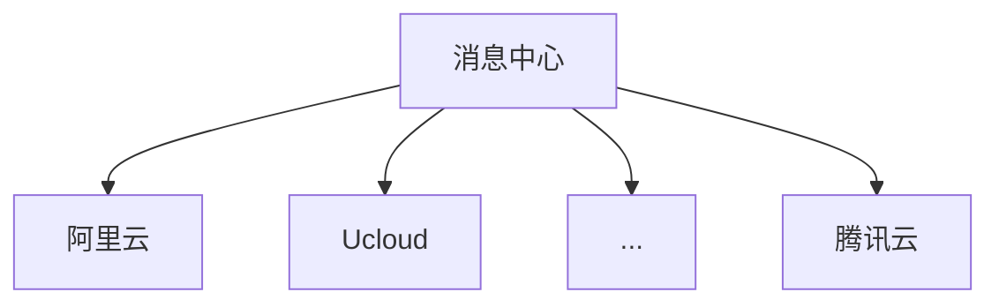

# 前言
我们在很多场景为了保证程序的健壮性会涉及多通道选择的问题，比如消息中心，签约中心等等有多供应商的情况。


此时会基于业务或权重、轮询等路由规则选择供应商，并执行具体第三方接口，但在上层代码（例如`face`层）应不需要关心路由逻辑，因为最终都会基于系统的模型进行逻辑处理。

```java
public CodeDTO createCode(Param param) {
    // 参数校验(重要)
    this.checkParam(param);
    // 根据路由规则获取供应商
    Server server = roundRule.choose();
    // 调用供应商的具体方法生成
    String code = server.nextId(param);
    // 存储签署节点
    nodeService.saveNode(param, code);
    // 响应
    return new CodeDTO(code);
}
```
# 改进目标
隐藏路由逻辑，上层只需要关心调用模型中的某个具体方法。
```java
public CodeDTO createCode(Param param) {
    // 参数校验(重要)
    this.checkParam(param);
    // 负载均衡器执行具体方法
    String code = iLoadBalancer.execute((iServer) -> iServer.nextId(param));
    // 存储签署节点
    nodeService.saveNode(param, code);
    // 响应
    return new CodeDTO(code);
}
```
# 具体实现


## 熔断器
借鉴了`Hystrix`的`半开、全开`思想，当异常次数大于阈值的时候会触发熔断，当`now() > 熔断时间 + 熔断时长`后会**进入半开状态**，此时允许请求通过，但当又**失败时会继续熔断**一个时间窗口，**成功则重置熔断参数**。
````
/**
 * @author wdl
 * @ClassName AbstractChannelImpl.java
 * @Description 通道实现抽象类
 * @createTime 2022-12-17 11:32
 */
public abstract class AbstractChannelImpl implements IChannel {

    /**
     * 熔断时间点
     */
    private final AtomicLong circuitClosed = new AtomicLong(-1);
    /**
     * 失败次数
     */
    private final AtomicInteger failCounter = new AtomicInteger(0);
    /**
     * 通道状态
     */
    private final AtomicReference<Status> status = new AtomicReference<>(Status.OPEN);

    /**
     * 熔断时长
     */
    protected Long circuitTime = 10L * 60 * 1000;
    /**
     * 触发熔断的失败次数上限
     */
    protected Integer circuitCount = 10;

    enum Status {
        CLOSED, OPEN;
    }

    /**
     * 通道初始化
     * @param circuitTime 熔断时长,必传
     * @param circuitCount 熔断连续失败次数,必传
     * @param circuitClosed 熔断时间点
     * @param failCounter 连续失败次数
     */
    public void initialize(long circuitTime, int circuitCount, LocalDateTime circuitClosed, Integer failCounter) {
        this.circuitTime = circuitTime;
        this.circuitCount = circuitCount;
        if (circuitClosed != null) {
            this.circuitClosed.set(circuitClosed.toInstant(ZoneOffset.of("+8")).toEpochMilli());
        }
        if (failCounter != null) {
            this.failCounter.set(failCounter);
        }
    }

    public abstract void initialize(LocalDateTime circuitClosed, Integer failCounter);

    /**
     * 获取当前通道id
     * @return
     */
    @Override
    public abstract Integer getChannelId();

    @Override
    public boolean isOpen() {
        return status.get().equals(Status.OPEN);
    }

    @Override
    public boolean allowRequest() {
        return isOpen() || isAfterSleepWindow();
    }

    @Override
    public void markSuccess() {
        status.set(Status.OPEN);
        failCounter.set(0);
        circuitClosed.set(-1L);
    }

    @Override
    public void markNonSuccess() {
        status.set(Status.CLOSED);
        circuitClosed.set(System.currentTimeMillis());
    }

    @Override
    public boolean attemptExecution() {
        Integer failCount = failCounter.incrementAndGet();
        if (failCount > circuitCount) {
            this.markNonSuccess();
        }
        return true;
    }

    /**
     * 是否到熔断时间后
     * @return
     */
    private boolean isAfterSleepWindow() {
        return System.currentTimeMillis() > circuitClosed.get() + circuitTime;
    }
}
````

## 路由规则
### 轮询路由
路由对象中通过`Atomic incr`记录路由次数，再通过 `atomic % server数组长度` 进行取余计算获取数组下标。
```` java
/**
 * @author wdl
 * @ClassName RoundRule.java
 * @Description 轮询路由规则
 * list = [A, B, C, D]
 * choose() => count.incr
 * index = count % list.size
 * channel = list.get(index)
 * @createTime 2022-12-17 22:51
 */
public class RoundRule implements IRule{

    private Logger log = LoggerFactory.getLogger(this.getClass());

    /**
     * 计数器，用来计算索引
     */
    private final AtomicInteger nextServerCyclicCounter = new AtomicInteger(0);

    @Override
    public IChannel choose(List<IChannel> channelList) {
        int count = 0;
        IChannel iChannel = null;
        while (iChannel == null && count++ < 10) {
            iChannel = channelList.get(getNextIndex(channelList.size()));
            if (iChannel != null && iChannel.allowRequest()) {
                break;
            }
            log.debug("channel：{} interrupt，afresh load", iChannel == null ? null : iChannel.getChannelId());
            iChannel = null;
        }
        return Optional.ofNullable(iChannel).orElse(channelList.get(0));
    }

    /**
     * 计算下个通道的索引值(绝对值，防止计数溢出)
     * @param modulo
     * @return
     */
    private int getNextIndex(int modulo) {
        return Math.abs((nextServerCyclicCounter.getAndIncrement() % modulo));
    }

}
````
### 权重路由
根据通道的权重进行分段，并在`[0, 总和)`范围中获取随机数，再判断落在那个区间中。

```` java
/**
 * @author wdl
 * @ClassName WeightRule.java
 * @Description 权重路由规则
 * A(wt=10), B(wt=30), C(wt=40), D(wt=20).
 * [0, 10)   A'wt region = (A's weight)
 * [11, 40)  B'wt region = (A's weight + B's weight)
 * [41, 80)  C'wt region = (A's weight + B's weight + C's weight)
 * [81, 100) D'wt region = (A's weight + B's weight + C's weight + D's weight)
 * randomFactory.nextInt(total weight) => random
 * random=10 => B; random=0 => A; random=40 => C; random=85 => D;
 * @createTime 2022-12-17 11:08
 */
public class WeightRule implements IRule {

    private Logger log = LoggerFactory.getLogger(WeightRule.class);

    /**
     * 随机器
     */
    private Random randomFactory = new Random();

    /**
     * 权重配置<channelId, 权重数值>
     */
    private NavigableMap<Integer, Integer> weightConfig;

    public WeightRule(){}

    public WeightRule(Map<String, Integer> weightConfigMap) {
        initialize(weightConfigMap);
    }

    /**
     * 权重配置初始化
     * @param weightConfig
     */
    public void initialize(Map<String, Integer> weightConfig) {
        NavigableMap<Integer, Integer> config = new TreeMap<>();
        int total = 0;
        for(Map.Entry<String, Integer> entry : weightConfig.entrySet()) {
            config.putIfAbsent(total+=entry.getValue(), Integer.valueOf(entry.getKey()));
        }
        this.weightConfig = config;
    }

    public NavigableMap<Integer, Integer> getWeightConfig() {
        return this.weightConfig;
    }

    /**
     * 根据权重从集合中随机选择通道<br/>
     * 1、选择通道后会判断通道状态
     * 2、熔断通道会被剔除权重配置，其余通道参与下一次分配
     * 当权重配置为空时,返回channelList第一个元素
     * @param channelList
     * @return
     */
    @Override
    public IChannel choose(List<IChannel> channelList) {
        NavigableMap<Integer, Integer> localWeightConfig = new TreeMap(this.weightConfig);
        IChannel iChannel = null;
        while (iChannel == null && !localWeightConfig.isEmpty()) {
            Map.Entry<Integer, Integer> entry = getChannelEntry(localWeightConfig);
            iChannel = channelList.stream() .filter(channel -> entry.getValue().equals(channel.getChannelId()))
                    .findFirst().orElse(null);
            if (iChannel != null && iChannel.allowRequest()) {
                break;
            }
            log.debug("channel：{} interrupt，afresh load", iChannel == null ? null : iChannel.getChannelId());
            iChannel = null;
            localWeightConfig.remove(entry.getKey());
        }
        return Optional.ofNullable(iChannel).orElse(channelList.get(0));
    }

    public Map.Entry<Integer, Integer> getChannelEntry(NavigableMap<Integer, Integer> localWeightConfig) {
        Integer totalWeight = localWeightConfig.keySet().stream().mapToInt(Integer::valueOf).max().getAsInt();
        int random = randomFactory.nextInt(totalWeight);
        Map.Entry<Integer, Integer> entry = localWeightConfig.higherEntry(random);
        log.debug("NavigableMap-elements:{} {}-{}-{}", localWeightConfig, totalWeight, random, entry);
        return entry;
    }
}
````
## 负载均衡器
基于Ribbon负载思想，通过默认的Rule或者方法参数的Rule获取实际通道，再将通道作为参数执行`function`方法，调用具体通道的实际方法。
```` 
/**
 * @author wdl
 * @ClassName LoadBalancerClient.java
 * @Description 负载均衡客户端
 * @createTime 2022-12-17 16:47
 */
public class ChannelLoadBalancerClient implements IChannelLoadBalancer {

    private Logger log = LoggerFactory.getLogger(this.getClass());

    /**
     * 通道集合
     */
    private final List<IChannel> channelList = new ArrayList<>();
    /**
     * 默认路由规则
     */
    private IRule defaultRule;

    public ChannelLoadBalancerClient(IChannel... channels) {
        Collections.addAll(channelList, channels);
    }

    public ChannelLoadBalancerClient(IRule rule, IChannel... channels) {
        this(channels);
        this.defaultRule = rule;
    }

    @Override
    public List<IChannel> getAllChannel() {
        return new ArrayList<>(channelList);
    }

    @Override
    public IChannel chooseChannel(IRule rule) {
        return rule.choose(getAllChannel());
    }

    @Override
    public <T extends IChannel, R> R execute(Function<T, R> function, IRule rule) {
        IChannel channel = this.chooseChannel(rule);
        log.debug("channel:{}", channel.getChannelId());
        return function.apply((T) channel);
    }

    @Override
    public <T extends IChannel, R> R execute(Function<T, R> function) {
        return execute(function, defaultRule);
    }

}
````
